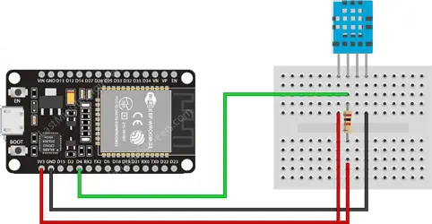

# TeleTemp3000: The IoT Temperature Alert System for IT Guys

<p align="center">

</p>

Need a quick, geeky way to keep an eye on your data center's temperature? TeleTemp3000 is the ultimate DIY IoT thermometer for IT enthusiasts who prefer to build things themselves. Powered by an ESP32 and a DHT11 sensor, this setup sends real-time alerts to Telegram when things start to heat up and even lets you ping the device on demand to get the current temperature right on your phone.

Perfect for those who want to monitor server room conditions without spending a lot on professional equipment, TeleTemp3000 combines practical functionality with a touch of nerdy flair. This low-cost project can be built for under 10$ using affordable components, making it an ideal choice for hobbyists and DIYers

> **Disclaimer:** This project uses a hobby-grade sensor, not a professional one. It’s meant for fun and experimentation—perfect for adding a bit of IoT flair to your tech toolkit!

## Table of Contents
- [Hardware Requirements](#hardware-requirements)
- [Project Setup](#project-setup)
- [Configuration](#configuration)
- [Usage](#usage)
- [3D Printed Case](#3d-printed-case)
- [Credits](#credits)

## Hardware Requirements

- **ESP32 Dev Board**
- **DHT11 Temperature/Humidity Sensor**
- **10kΩ Resistor**
- **Wires**
- **3D Printed Case** (optional, still under development)

## Project Setup

1. Connect the DHT11 sensor to the ESP32 according to the following:
   - Data pin of DHT11 to pin 4 on ESP32.
   - Power and ground connections as required.
   - Use the 10kΩ resistor for stable sensor readings.



## Configuration

To get the system running, you need to configure the following settings within the code:

- **WiFi Credentials:** Set your WiFi network SSID and password in the `WIFI_SSID` and `WIFI_PASSWORD` variables.
  
- **Telegram Bot Token:** Obtain a Telegram bot token via [BotFather](https://telegram.me/BotFather) and set it in `BOT_TOKEN`. Enter your Telegram chat ID in the `CHAT_ID` variable to receive alerts.

- **Temperature Threshold:** Adjust the alert threshold by modifying `TEMP_ALERT_THRESHOLD`. The default is set to 28°C.

```cpp
#define WIFI_SSID "YourNetworkSSID"
#define WIFI_PASSWORD "YourNetworkPassword"
#define BOT_TOKEN "YourTelegramBotToken"
#define CHAT_ID "YourTelegramChatID"

const float TEMP_ALERT_THRESHOLD = 28.0;
```

## Usage

- **Monitoring Commands:**
  - `/start` – Displays a welcome message with the current temperature threshold.
  - `/temp` – Retrieves the current temperature in Celsius.
  - `/humidity` – Retrieves the current humidity level.
  - **Ping the device** on Telegram to get the latest readings anytime you want!

- **Alerting Mechanism:**  
When the temperature exceeds the configured threshold, the system sends an alert message via Telegram. If the temperature remains above the threshold, TeleTemp3000 will continue sending notifications every X minutes until the temperature drops back below the threshold.

## 3D Printed Case

The 3D-printed case design for TeleTemp3000 is still a work in progress. The current version is functional but may not be perfect. For best results, print the model at 115% scale. The necessary files for the case are available in the assets folder of this repository.

## Credits

Developed by manu, with support on source code development by [biste](https://github.com/biste5). 
